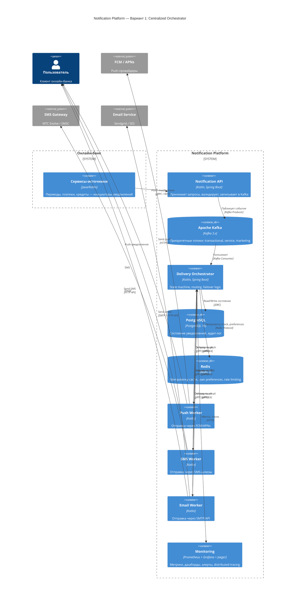
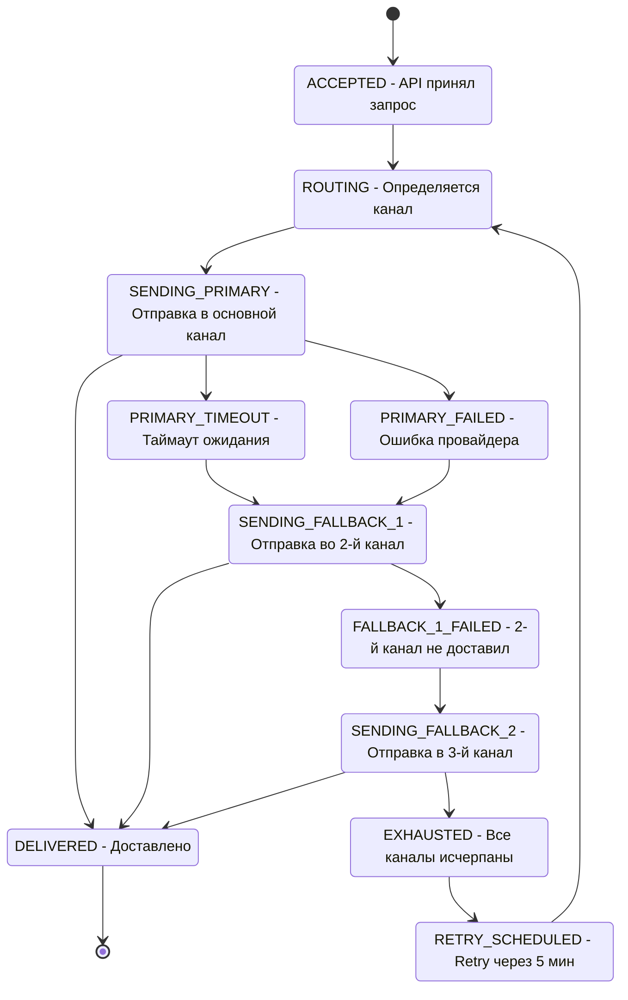
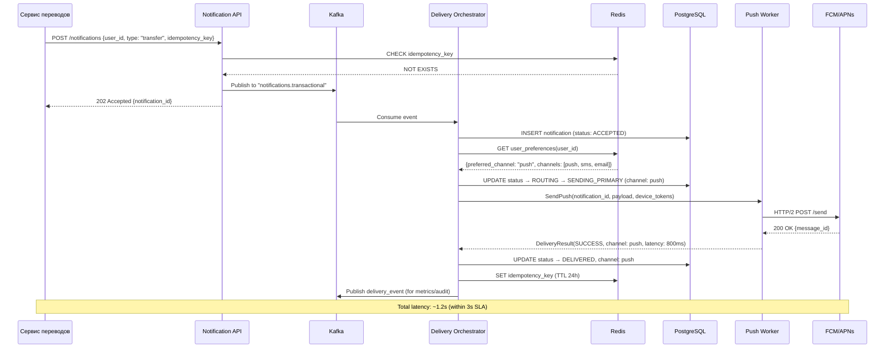
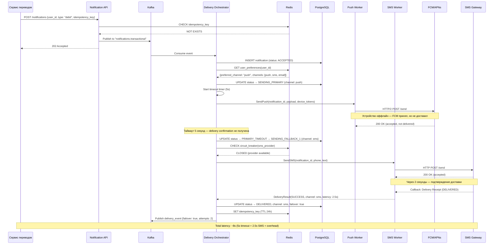
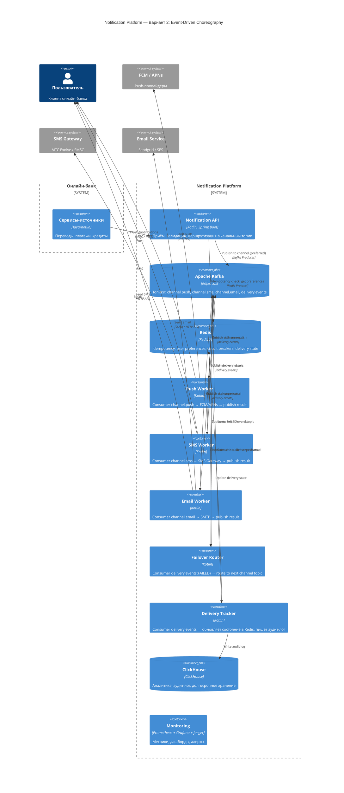
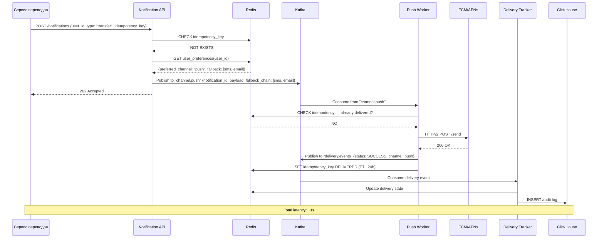
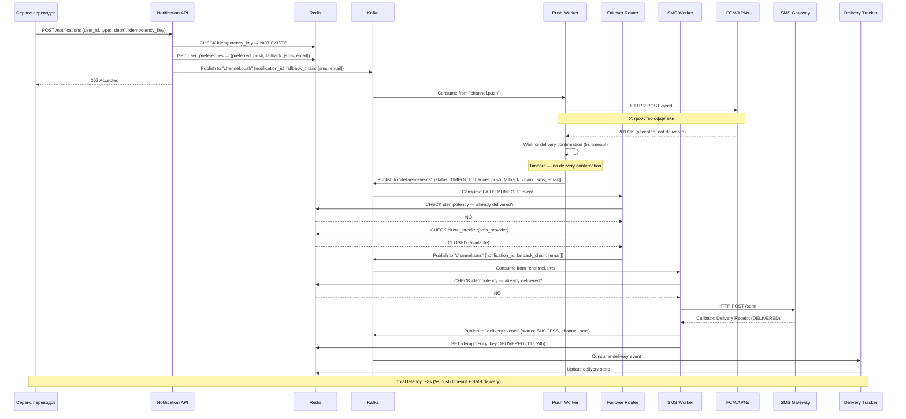

# RFC: Гарантированная доставка критичных уведомлений с кросс-канальным failover

|     Метаданные      | Значение                             |
|:-------------------:|--------------------------------------|
|     **Статус**      | DRAFT                                |
|    **Автор(ы)**     | Владислав Веселов                    |
|  **Ответственный**  | Владислав Веселов                    |
| **Бизнес-заказчик** | Product Owner, Notification Platform |
|    **Ревьюеры**     | —                                    |
|  **Дата создания**  | 2026-04-07                           |
| **Дата обновления** | 2026-04-07                           |

---

## Оглавление

1. [Контекст](#контекст)
2. [Пользовательские сценарии](#пользовательские-сценарии)
3. [Требования](#требования)
4. [Варианты решения](#варианты-решения)
5. [Сравнительный анализ](#сравнительный-анализ)
6. [Выводы](#выводы)
7. [Приложения](#приложения)

---

## Контекст

### Проблема

В текущей архитектуре онлайн-банка каждая продуктовая команда реализует отправку уведомлений самостоятельно: сервис
переводов напрямую вызывает SMS-шлюз, сервис кредитов отправляет email через свой SMTP-клиент, мобильное приложение
получает push через отдельную интеграцию с FCM/APNs. Это приводит к:

- **Задержкам доставки** — нет единого SLA, каждая интеграция работает с разной скоростью
- **Дублированию** — при retry на уровне отдельных сервисов пользователь может получить одно уведомление несколько раз
- **Отсутствию централизованного контроля** — нет единого дашборда, невозможно отследить судьбу конкретного уведомления
- **Невозможности гарантировать доставку** — если push не дошёл, нет автоматического переключения на SMS или email

### Цель данного RFC

Спроектировать **подсистему гарантированной доставки** в рамках централизованной Notification Platform, которая:

- Гарантирует доставку критичного (транзакционного) уведомления хотя бы через один канал
- Автоматически переключается на резервный канал при отказе основного (failover)
- Учитывает пользовательские настройки (предпочтительный канал)
- Минимизирует стоимость доставки (push дешевле SMS)
- Обеспечивает наблюдаемость процесса
- Предотвращает дублирование при failover

### Ключевые вопросы

- Как обеспечить доставку критичного уведомления за ≤3 секунды при доступности основного канала?
- Как организовать failover между push → SMS → email без дублирования?
- Как масштабировать систему на 6M транзакционных уведомлений в день с пиками до 350 rps?

---

## Пользовательские сценарии

| Приоритет   | Тип сценария          | Действующее лицо  | Сценарий                                                                                                                                                                        |
|-------------|-----------------------|-------------------|---------------------------------------------------------------------------------------------------------------------------------------------------------------------------------|
| MUST HAVE   | Транзакционный        | Пользователь      | Пользователь совершает перевод. Система отправляет push-уведомление. Push доставлен за 1 секунду. Пользователь видит подтверждение на экране.                                   |
| MUST HAVE   | Failover              | Пользователь      | Пользователь совершает оплату. Push не доставлен (устройство оффлайн). Через 5 секунд система автоматически отправляет SMS. Пользователь получает SMS с информацией о списании. |
| MUST HAVE   | Двойной failover      | Пользователь      | Push недоставлен, SMS-шлюз недоступен (circuit breaker open). Система отправляет email. Пользователь получает email с деталями операции.                                        |
| MUST HAVE   | Настройки             | Пользователь      | Пользователь указал SMS как предпочтительный канал. Транзакционное уведомление отправляется сначала по SMS, при неудаче — push, затем email.                                    |
| SHOULD HAVE | Мониторинг            | Оператор          | Оператор видит на дашборде рост failover rate с push на SMS. Создаёт инцидент для команды мобильной разработки.                                                                 |
| SHOULD HAVE | Аудит                 | Compliance-офицер | Compliance-офицер запрашивает историю доставки конкретного уведомления: все попытки по всем каналам с таймстемпами и статусами.                                                 |
| COULD HAVE  | Пользовательский опыт | Пользователь      | Пользователь отключил уведомления в настройках ОС. В приложении отображается in-app уведомление при следующем открытии (fallback для push).                                     |

---

## Требования

### Функциональные требования

| № | Приоритет   | ID  | Требование                                                                                                                                 |
|---|-------------|-----|--------------------------------------------------------------------------------------------------------------------------------------------|
| 1 | MUST HAVE   | FR1 | Система принимает запрос на доставку транзакционного уведомления и гарантирует его доставку хотя бы через один канал (push, SMS, email)    |
| 2 | MUST HAVE   | FR2 | При неудаче доставки через основной канал система автоматически переключается на следующий канал по приоритету в рамках заданного таймаута |
| 3 | MUST HAVE   | FR3 | Система учитывает предпочтительный канал пользователя при выборе порядка failover. Транзакционные уведомления нельзя отключить.            |
| 4 | MUST HAVE   | FR4 | Система предотвращает дублирование: если уведомление уже доставлено через один канал, отправка через другие каналы не инициируется         |
| 5 | MUST HAVE   | FR5 | Система хранит полный аудит-лог каждого уведомления: все попытки доставки, каналы, статусы, таймстемпы                                     |
| 6 | SHOULD HAVE | FR6 | Система обнаруживает недоступность провайдера канала (circuit breaker) и пропускает недоступный канал при failover                         |
| 7 | SHOULD HAVE | FR7 | Система предоставляет API для запроса статуса доставки конкретного уведомления                                                             |

### Нефункциональные требования

| № | Приоритет   | ID   | Требование                                                                                                                     |
|---|-------------|------|--------------------------------------------------------------------------------------------------------------------------------|
| 1 | MUST HAVE   | NFR1 | Latency: ≤ 3 секунд (p95) от приёма запроса до доставки через основной канал                                                   |
| 2 | MUST HAVE   | NFR2 | Availability: SLA 99.95% для endpoint-а приёма уведомлений (≤ 4.4 часа downtime/год)                                           |
| 3 | MUST HAVE   | NFR3 | Reliability: delivery rate ≥ 99.9% для транзакционных уведомлений (at-least-once семантика, с дедупликацией на уровне каналов) |
| 4 | MUST HAVE   | NFR4 | Scalability: 6M транзакционных уведомлений/день, пиковая нагрузка до 350 rps                                                   |
| 5 | MUST HAVE   | NFR5 | Durability: ни одно принятое уведомление не должно быть потеряно (персистентная очередь + WAL)                                 |
| 6 | SHOULD HAVE | NFR6 | Observability: distributed tracing каждого уведомления, метрики latency/success/failover rate в реальном времени               |
| 7 | SHOULD HAVE | NFR7 | Cost: минимизация стоимости — push в приоритете; доля SMS-failover ≤ 15% от общего объёма транзакционных                       |

### Архитектурно значимые требования (ASR)

#### ASR1: Низкая задержка доставки транзакционных уведомлений (Приоритет: Критический)

**Связанные требования:** FR1, FR2, NFR1

**Почему влияет на архитектуру:**
Требует минимизации количества промежуточных сервисов на пути уведомления, выделенных очередей для транзакционных
уведомлений с гарантированной ёмкостью. Настройки канала пользователя должны быть закэшированы заранее (в Redis), чтобы
не ходить в БД в момент обработки.

#### ASR2: Гарантированная доставка с failover без дублирования (Приоритет: Критический)

**Связанные требования:** FR2, FR4, NFR3, NFR5

**Почему влияет на архитектуру:**
Требует персистентного state machine для каждого уведомления. Определяет наличие idempotency layer-а. Диктует выбор
между паттернами координации (оркестрация vs хореография). Необходимы механизмы таймаутов и delivery confirmation от
провайдеров.

#### ASR3: Высокая пропускная способность (Приоритет: Высокий)

**Связанные требования:** NFR2, NFR4

**Почему влияет на архитектуру:**
Требует горизонтального масштабирования. Определяет выбор брокера сообщений (высокий throughput + партиционирование).
Необходим rate limiting к внешним провайдерам. Партиционирование по user_id для гарантии порядка уведомлений одного
пользователя.

#### ASR4: Наблюдаемость (Приоритет: Высокий)

**Связанные требования:** FR5, FR7, NFR6

**Почему влияет на архитектуру:**
Каждый компонент должен пробрасывать trace_id. Необходимо хранилище для аудит-лога с retention. Нужен отдельный путь
сбора метрик, не влияющий на latency основного потока.

### Расчёт нагрузок

```
Исходные данные:
  MAU: 10 000 000 пользователей
  DAU: 3 000 000 пользователей
  Транзакционные уведомления на пользователя в день: 2

Объём транзакционных уведомлений:
  В день: 3 000 000 × 2 = 6 000 000
  В секунду (среднее): 6 000 000 / 86 400 ≈ 70 rps
  В секунду (пик, ×5): ≈ 350 rps

Failover-трафик (при 10% failover rate):
  Дополнительных попыток: 600 000/день
  Пиковый failover: 35 rps
  Итого пиковый rps (с failover): ≈ 385 rps

Сеть и storage:
  Средний размер сообщения: ~1 KB (payload + metadata)
  Throughput: 385 rps × 1 KB = ~385 KB/s ≈ 0.4 MB/s
  Storage (аудит-лог): 6 000 000 × 1.5 KB (с историей попыток) ≈ 9 GB/день ≈ 270 GB/месяц

Внешние провайдеры:
  Push (FCM/APNs): до 350 rps (основной канал)
  SMS (failover): до 35 rps при 10% failover rate
    Стоимость SMS: 35 rps × 86 400 × 2 руб ≈ 6 000 000 руб/день (worst case peak)
    Реалистично (10% failover): 600 000 × 2 руб = 1 200 000 руб/день
  Email (двойной failover): до 5 rps (≈1-2% от общего объёма)

Kafka:
  Партиции топика транзакционных: 
    Target: 385 rps / ~5000 msg/s на партицию ≈ min 1 партиция
    С запасом на рост (×10): 8-12 партиций
  Retention: 7 дней × 9 GB ≈ 63 GB

PostgreSQL (state machine):
  Записей: 6 000 000/день, ~180M/месяц
  Размер записи: ~500 байт
  Объём: ~90 GB/месяц (с индексами — ~150 GB/месяц)
  IOPS: 385 rps × 3 операции (insert + update × 2) ≈ 1 155 IOPS (peak)

Redis (idempotency + user preferences):
  Ключей idempotency: 6M/день × TTL 24h ≈ 6M ключей × 100 байт = ~600 MB
  User preferences cache: 10M пользователей × 200 байт = ~2 GB
  Итого: ~3 GB RAM
```

---

## Варианты решения

### Вариант 1: Centralized Delivery Orchestrator

> **Описание:** Центральный сервис-оркестратор управляет жизненным циклом каждого уведомления через явную state machine.
> Orchestrator принимает решения о маршрутизации, failover и дедупликации. Состояние хранится в PostgreSQL, координация
> через Kafka.

#### Архитектура

##### C4 Container Diagram



##### State Machine уведомления



**Таймауты по каналам:** push — 5s, SMS — 30s, email — 60s.

##### Sequence Diagram: Happy Path (push доставлен)



##### Sequence Diagram: Failover (push failed → SMS)



#### Как решение выполняет каждый ASR

| ASR                             | Как выполняется                                                                                                                                                                                                                                                        |
|---------------------------------|------------------------------------------------------------------------------------------------------------------------------------------------------------------------------------------------------------------------------------------------------------------------|
| ASR1 (Latency ≤3s)              | Отдельный Kafka-топик `notifications.transactional` с выделенной группой consumer-ов. Настройки канала пользователя закэшированы в Redis. Прямой gRPC вызов к Push Worker. При доступности push — доставка за ~1-1.5s.                                                 |
| ASR2 (Гарантированная доставка) | Явная state machine в PostgreSQL. Idempotency key в Redis с TTL. Уведомление сначала сохраняется в БД, затем публикуется в Kafka — так мы не теряем данные даже при сбое брокера. Таймауты: push 5s → SMS 30s → email 60s. Retry schedule при исчерпании всех каналов. |
| ASR3 (Throughput)               | Kafka с 8-12 партициями по `user_id`. Горизонтальное масштабирование Orchestrator (каждый instance обрабатывает подмножество партиций). Ограничение частоты запросов к провайдерам через Redis (чтобы не превысить их лимиты).                                         |
| ASR4 (Observability)            | trace_id пробрасывается от API до провайдера (OpenTelemetry). Каждое изменение state machine логируется в PostgreSQL. Prometheus-метрики на каждом hop. Grafana-дашборд с SLA compliance.                                                                              |

#### Технологии

| Компонент                   | Технология             | Обоснование                                                                               |
|-----------------------------|------------------------|-------------------------------------------------------------------------------------------|
| Брокер сообщений            | Apache Kafka 3.x       | Высокий throughput, партиционирование, durability, replay возможность                     |
| State storage               | PostgreSQL 16          | ACID-транзакции для state machine, надёжность, зрелый инструментарий                      |
| Cache / Idempotency         | Redis 7 (Cluster)      | Очень быстрый доступ (< 1ms), TTL для idempotency keys, атомарные операции                |
| Межсервисное взаимодействие | gRPC                   | Низкая latency, строгая типизация, streaming для callback-ов                              |
| Tracing                     | OpenTelemetry + Jaeger | Стандартизированный distributed tracing                                                   |
| Метрики                     | Prometheus + Grafana   | Push/pull метрики, готовые дашборды, алертинг                                             |
| Язык                        | Kotlin + Spring Boot   | Основной стек банка, хорошая поддержка асинхронности, готовые библиотеки для Kafka и gRPC |

#### Этапы реализации

| Этап | Описание                                                     | Планируемый срок | Ресурсы             | Риски                                                             |
|------|--------------------------------------------------------------|------------------|---------------------|-------------------------------------------------------------------|
| 1    | MVP: API + Kafka + Orchestrator + Push Worker (без failover) | 4 недели         | 2 backend, 1 DevOps | Интеграция с FCM/APNs может занять больше времени                 |
| 2    | Failover: state machine + SMS/Email Workers + idempotency    | 3 недели         | 2 backend           | Корректность state machine при конкурентных обновлениях           |
| 3    | Observability: tracing + метрики + дашборды + алерты         | 2 недели         | 1 backend, 1 SRE    | Нагрузка от трейсинга на основной pipeline                        |
| 4    | Нагрузочное тестирование + hardening                         | 2 недели         | 1 backend, 1 QA     | Реальные характеристики провайдеров могут отличаться от ожидаемых |

#### Преимущества

- **Явная state machine** — состояние каждого уведомления в одном месте, легко отслеживать и дебажить
- **Централизованный контроль** — вся failover-логика в одном сервисе, проще менять стратегию
- **Простая дедупликация** — Orchestrator проверяет idempotency key до отправки, один source of truth
- **Предсказуемая observability** — trace проходит через центральную точку, легко построить end-to-end view
- **Проще compliance** — аудит-лог в PostgreSQL с ACID-гарантиями

#### Недостатки

- **Orchestrator — потенциальная точка отказа** — смягчается горизонтальным масштабированием по Kafka partition key и
  резервной репликой PostgreSQL
- **Нагрузка на PostgreSQL** — ~1 100 IOPS при пиковой нагрузке; при значительном росте может потребоваться
  партиционирование таблиц или шардирование
- **Связность** — Orchestrator знает обо всех каналах, изменение логики failover требует его релиза
- **Latency overhead** — дополнительный hop через Orchestrator добавляет ~50-100ms к каждой доставке

---

### Вариант 2: Event-Driven Choreography

> **Описание:** Нет центрального оркестратора. Каждый Channel Worker — независимый consumer Kafka-топика. Failover
> реализуется через события: при неудаче worker публикует событие `delivery.failed`, которое подхватывает Failover
> Router
> и направляет в топик следующего канала. Состояние распределено между Kafka и Redis.

#### Архитектура

##### C4 Container Diagram



##### Sequence Diagram: Happy Path (push доставлен)



##### Sequence Diagram: Failover (push timeout → SMS)



#### Как решение выполняет каждый ASR

| ASR                             | Как выполняется                                                                                                                                                                               |
|---------------------------------|-----------------------------------------------------------------------------------------------------------------------------------------------------------------------------------------------|
| ASR1 (Latency ≤3s)              | API сразу публикует в канальный топик (минуя оркестратор). Push Worker — dedicated consumer с минимальным overhead. При доступности push — доставка за ~1s.                                   |
| ASR2 (Гарантированная доставка) | Idempotency check на каждом этапе (в Redis). Fallback chain передаётся в сообщении. Failover Router подхватывает failure events и направляет в следующий канал. Delivery Tracker ведёт аудит. |
| ASR3 (Throughput)               | Каждый канал — независимый consumer group, масштабируется отдельно. Kafka партиционирует по user_id. Нет узкого места в виде единого оркестратора.                                            |
| ASR4 (Observability)            | Delivery Tracker консьюмит все события и строит полную картину. ClickHouse для аналитики и аудита. Prometheus-метрики с каждого worker-а. trace_id в headers каждого Kafka-сообщения.         |

#### Технологии

| Компонент                   | Технология                           | Обоснование                                                           |
|-----------------------------|--------------------------------------|-----------------------------------------------------------------------|
| Брокер сообщений            | Apache Kafka 3.x                     | Высокий throughput, топики per channel, event replay                  |
| Delivery State              | Redis 7 (Cluster)                    | Быстрый distributed state, idempotency, circuit breakers              |
| Аудит-лог / Аналитика       | ClickHouse                           | Колоночное хранение, быстрые аналитические запросы на больших объёмах |
| Межсервисное взаимодействие | Kafka (events) + gRPC (sync queries) | Events для асинхронной координации, gRPC для синхронных запросов      |
| Tracing                     | OpenTelemetry + Jaeger               | Стандартизированный distributed tracing                               |
| Метрики                     | Prometheus + Grafana                 | Push/pull метрики, алертинг                                           |
| Язык                        | Kotlin + Spring Boot                 | Единый стек с остальным банком                                        |

#### Этапы реализации

| Этап | Описание                                                | Планируемый срок | Ресурсы             | Риски                                                    |
|------|---------------------------------------------------------|------------------|---------------------|----------------------------------------------------------|
| 1    | MVP: API + Push Worker + delivery events (без failover) | 3 недели         | 2 backend, 1 DevOps | Отладка event flow без центрального контроллера          |
| 2    | Failover Router + SMS/Email Workers + idempotency       | 4 недели         | 3 backend           | Сложность distributed state consistency; race conditions |
| 3    | Delivery Tracker + ClickHouse + observability           | 3 недели         | 2 backend, 1 SRE    | ClickHouse инфраструктура, retention-политики            |
| 4    | Нагрузочное тестирование + hardening                    | 2 недели         | 1 backend, 1 QA     | Event storms при массовых failover-ах                    |

#### Преимущества

- **Нет SPOF** — отсутствует центральный оркестратор, каждый компонент независим
- **Независимое масштабирование** — Push, SMS, Email worker-ы масштабируются отдельно в зависимости от нагрузки
- **Loosely coupled** — добавление нового канала (Telegram, WhatsApp) = новый worker + topic, без изменения существующих
  компонентов
- **Меньше latency на happy path** — API → Kafka → Worker → Provider, минуя оркестратор (на 1 hop меньше)
- **Event replay** — Kafka позволяет переиграть events при ошибке в logic

#### Недостатки

- **Распределённое состояние** — нет единого source of truth; состояние размазано между Redis и Kafka offsets; сложнее
  обеспечить consistency
- **Сложный debugging** — путь уведомления проходит через несколько независимых сервисов и топиков; для понимания полной
  картины нужен correlation ID и Delivery Tracker
- **Race conditions** — при failover между каналами возможны race conditions, когда push доставлен с задержкой, а SMS
  уже отправлено; дедупликация на уровне каждого worker-а сложнее, чем в centralized подходе
- **Event storms** — при массовом отказе push-провайдера миллионы failure events могут перегрузить Failover Router
- **Труднее гарантировать SLA** — без центральной точки сложнее контролировать end-to-end latency failover-цепочки

---

## Сравнительный анализ

### Ресурсные требования

| Критерий               | Вариант 1: Orchestrator              | Вариант 2: Choreography                              |
|------------------------|--------------------------------------|------------------------------------------------------|
| Время реализации       | ~11 недель                           | ~12 недель                                           |
| Команда                | 2-3 backend + 1 SRE + 1 QA           | 3-4 backend + 1 SRE + 1 QA                           |
| Инфраструктура         | Kafka + PostgreSQL + Redis           | Kafka + Redis + ClickHouse                           |
| Сложность эксплуатации | Средняя (один ключевой сервис)       | Высокая (много независимых компонентов + event flow) |
| Организационные риски  | Orchestrator — single team ownership | Размытая ответственность за end-to-end flow          |

### Соответствие требованиям

| Требование                       | Вариант 1: Orchestrator                       | Вариант 2: Choreography                                        |
|----------------------------------|-----------------------------------------------|----------------------------------------------------------------|
| FR1 (гарантированная доставка)   | ✅ Явная state machine                         | ✅ Event chain + idempotency                                    |
| FR2 (автоматический failover)    | ✅ Centralized failover logic                  | ✅ Failover Router + events                                     |
| FR3 (пользовательские настройки) | ✅ Routing в Orchestrator                      | ✅ Routing в API + fallback chain                               |
| FR4 (дедупликация)               | ✅ Один idempotency check в Orchestrator       | ⚠️ Distributed checks на каждом worker-е (риск race condition) |
| FR5 (аудит-лог)                  | ✅ PostgreSQL (ACID)                           | ✅ ClickHouse (eventually consistent)                           |
| FR6 (circuit breaker)            | ✅ Orchestrator проверяет перед отправкой      | ✅ Failover Router проверяет перед маршрутизацией               |
| FR7 (API статуса)                | ✅ Прямой запрос к PostgreSQL                  | ⚠️ Redis (volatile) + async sync с ClickHouse                  |
| NFR1 (latency ≤3s)               | ✅ ~1.2s happy path                            | ✅ ~1s happy path (меньше на 1 hop)                             |
| NFR2 (availability 99.95%)       | ⚠️ Зависит от Orchestrator HA                 | ✅ Нет SPOF                                                     |
| NFR3 (delivery ≥99.9%)           | ✅ Явная гарантия через state machine          | ⚠️ Зависит от consistency distributed state                    |
| NFR4 (scalability)               | ✅ Горизонтальное масштабирование по партициям | ✅ Независимое масштабирование каналов                          |
| NFR5 (durability)                | ✅ PostgreSQL WAL + Kafka                      | ✅ Kafka durability                                             |
| NFR6 (observability)             | ✅ Центральная точка наблюдения                | ⚠️ Требует Delivery Tracker для агрегации                      |
| NFR7 (cost)                      | ✅ Orchestrator контролирует выбор канала      | ✅ API определяет приоритет канала                              |

### Ключевые trade-offs

| Аспект                   | Orchestrator (Вариант 1)           | Choreography (Вариант 2)                  |
|--------------------------|------------------------------------|-------------------------------------------|
| **Consistency**          | Сильная (ACID в PostgreSQL)        | Eventual (Redis + events)                 |
| **Failure isolation**    | Orchestrator — единая точка отказа | Отказ worker-а не влияет на другие каналы |
| **Debugging**            | Просто — один сервис, одна БД      | Сложно — events разбросаны по топикам     |
| **Extensibility**        | Требует изменения Orchestrator     | Добавление нового worker-а + topic        |
| **Happy path latency**   | +50-100ms (дополнительный hop)     | Минимальная                               |
| **Failover correctness** | Высокая (centralized decision)     | Зависит от distributed consistency        |

---

## Выводы

> **Рекомендация: Вариант 1 — Centralized Delivery Orchestrator**

### Обоснование выбора

Для подсистемы гарантированной доставки **критичных банковских уведомлений** приоритетными являются:

1. **Корректность > производительность:** Транзакционные уведомления — это вопрос безопасности и доверия пользователя.
   Дубликат уведомления о списании (ложная тревога) или потерянное уведомление о мошенничестве — это инцидент. Вариант 1
   с ACID state machine обеспечивает строгую гарантию "ровно одна доставка" через централизованный idempotency check,
   тогда как в Варианте 2 race conditions между распределёнными worker-ами — риск, который сложно полностью устранить.

2. **Observability в регулируемой среде:** Банк обязан предоставить полную историю доставки уведомления по запросу
   регулятора. PostgreSQL с ACID-гарантиями — более надёжный источник, чем eventually consistent ClickHouse. Центральная
   точка наблюдения в Orchestrator упрощает compliance.

3. **Операционная простота:** Команда из 3-4 человек будет поддерживать систему. Один ключевой сервис с явной state
   machine проще дебажить, чем распределённый event flow. С одним ключевым сервисом команде проще разбираться, чем с
   распределённым event flow, особенно при текущем масштабе.

### Принятые компромиссы

| Компромисс             | Описание                                              | Митигация                                                                                                                        |
|------------------------|-------------------------------------------------------|----------------------------------------------------------------------------------------------------------------------------------|
| Orchestrator как SPOF  | При отказе Orchestrator все уведомления задерживаются | Горизонтальное масштабирование (N instances по Kafka partitions); резервная реплика PostgreSQL; health checks с автоперезапуском |
| Нагрузка на PostgreSQL | ~1 100 IOPS при пике; рост при увеличении нагрузки    | Connection pooling; архивация записей старше 30 дней; при значительном росте — партиционирование таблиц или шардирование         |
| Дополнительная latency | +50-100ms на hop через Orchestrator                   | Допустимо в рамках SLA 3s (happy path ~1.2s, запас 60%)                                                                          |
| Связность каналов      | Добавление нового канала требует релиза Orchestrator  | Strategy pattern для каналов; feature flags для плавного включения; в будущем при >5 каналов — рассмотреть гибридную модель      |

### Ограничения решения

- **Масштаб:** Решение рассчитано на текущую нагрузку (6M транзакционных/день). При кратном росте нагрузки может
  потребоваться шардирование PostgreSQL или комбинация подходов (Orchestrator для транзакционных + Choreography для
  маркетинговых).
- **Failover latency:** При полном failover (push → SMS → email) суммарная задержка может достигать ~45 секунд (5s push
  timeout + 30s SMS timeout + email delivery). Это приемлемо, так как альтернатива — полная недоставка.
- **Push delivery confirmation:** Система полагается на таймаут, а не на реальное подтверждение доставки на устройство.
  Оптимальное значение таймаута (5s) требует калибровки на основе реальных данных.

---

## Приложения

### Глоссарий

| Термин                     | Определение                                                                                                                                            |
|----------------------------|--------------------------------------------------------------------------------------------------------------------------------------------------------|
| Транзакционное уведомление | Уведомление, связанное с финансовой операцией (списание, перевод, пополнение). Критичное, не может быть отключено пользователем.                       |
| Failover                   | Автоматическое переключение на резервный канал доставки при недоступности или таймауте основного канала.                                               |
| State machine              | Конечный автомат, описывающий жизненный цикл уведомления от приёма до доставки.                                                                        |
| Idempotency key            | Уникальный ключ уведомления, предотвращающий повторную обработку (дубликат).                                                                           |
| Circuit breaker            | Паттерн, при котором система временно прекращает обращения к недоступному провайдеру, чтобы не тратить ресурсы и время на заведомо провальные попытки. |
| At-least-once delivery     | Гарантия доставки сообщения хотя бы один раз. Достигается за счёт сохранения уведомления в БД перед отправкой в брокер.                                |
| Consumer group             | Группа Kafka-consumer-ов, между которыми партиции топика распределяются автоматически.                                                                 |
| Dead letter queue (DLQ)    | Очередь для сообщений, которые не удалось обработать после N попыток.                                                                                  |
| SLA                        | Service Level Agreement — соглашение об уровне обслуживания (время доставки, доступность).                                                             |
| SPOF                       | Single Point of Failure — единая точка отказа, компонент, выход которого из строя приводит к отказу всей системы.                                      |
| FCM                        | Firebase Cloud Messaging — сервис Google для отправки push-уведомлений на Android.                                                                     |
| APNs                       | Apple Push Notification service — сервис Apple для отправки push-уведомлений на iOS.                                                                   |
